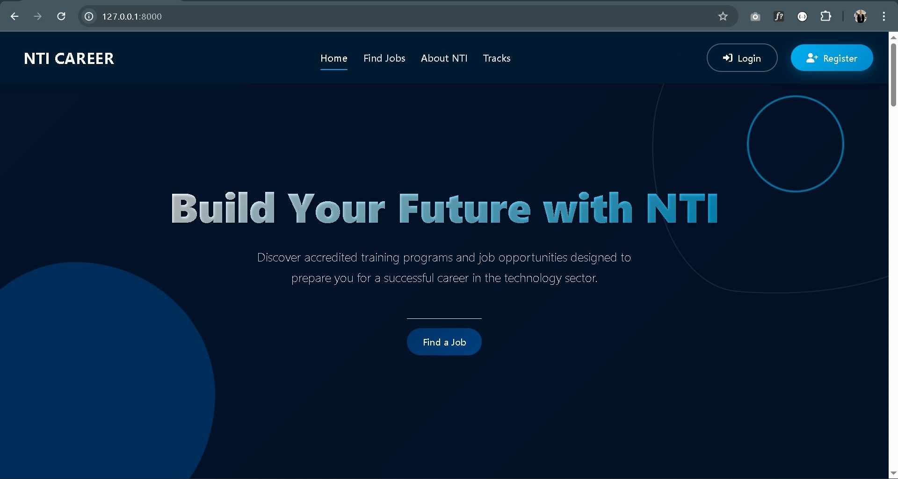
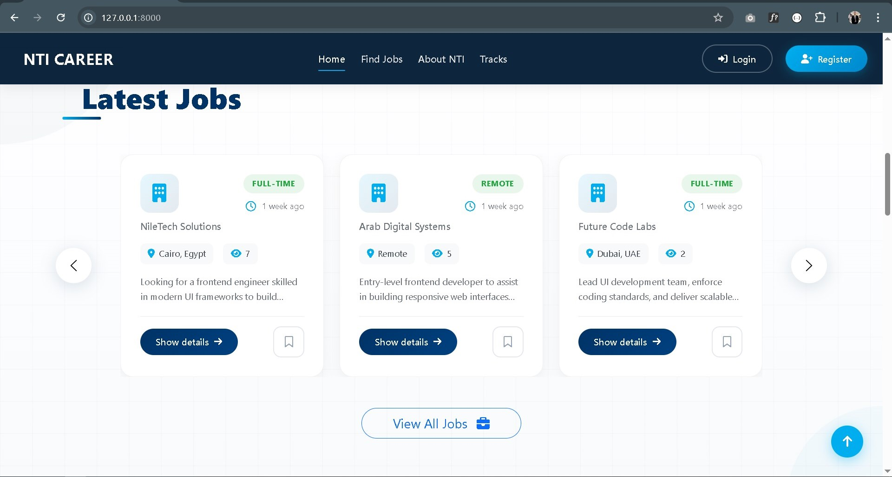
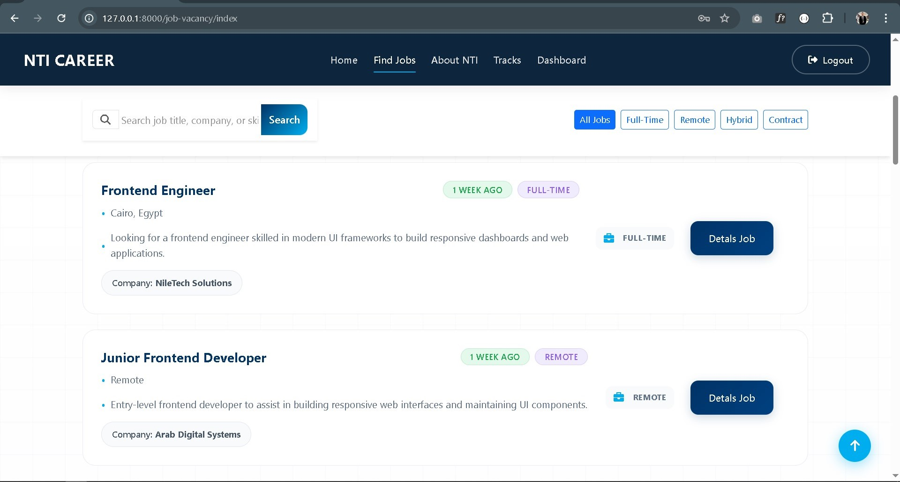
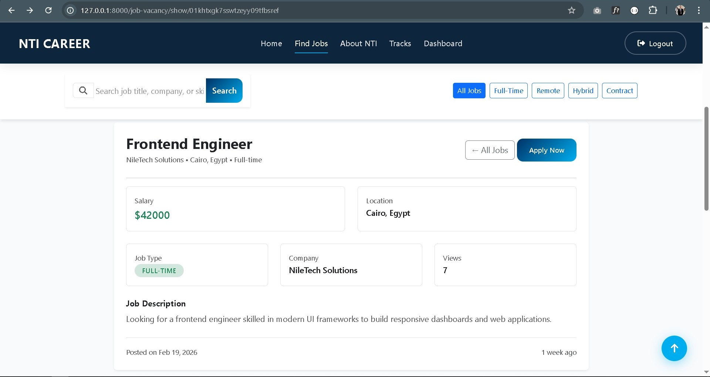
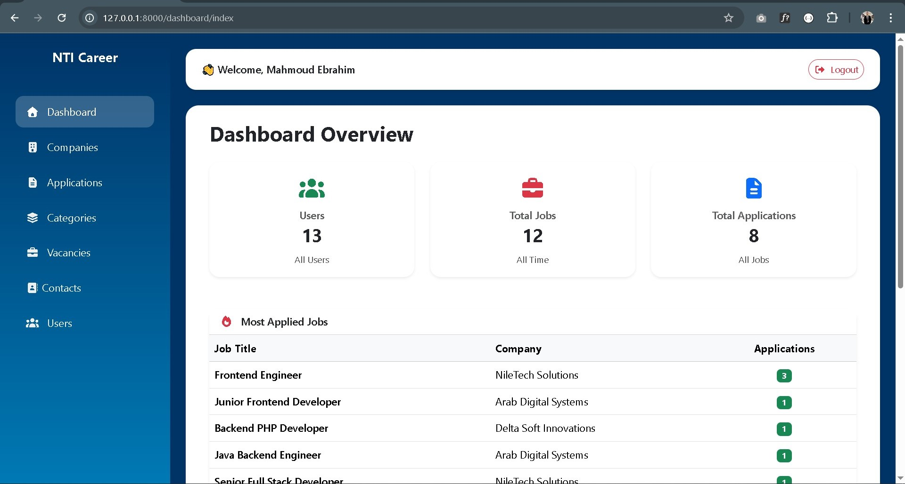
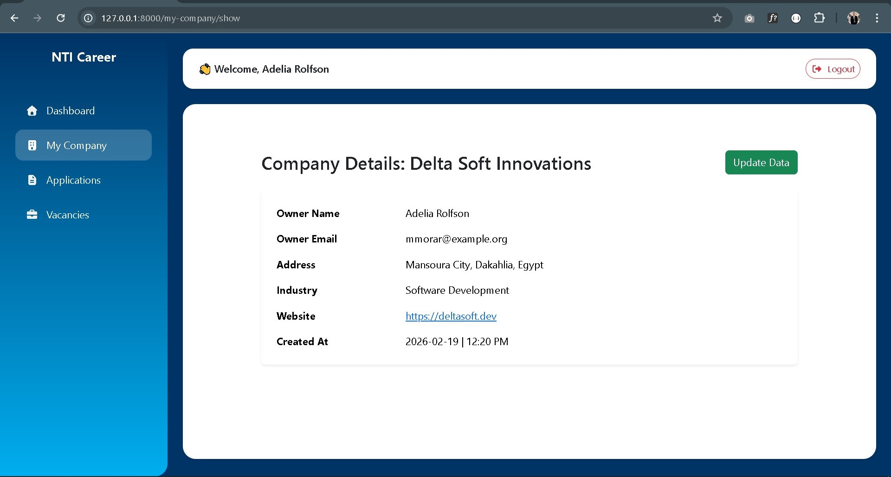
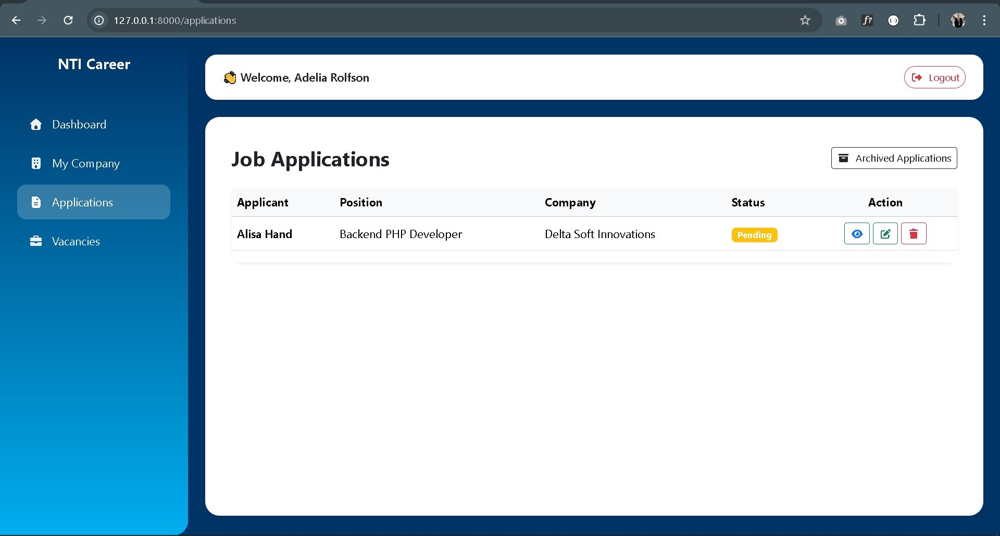
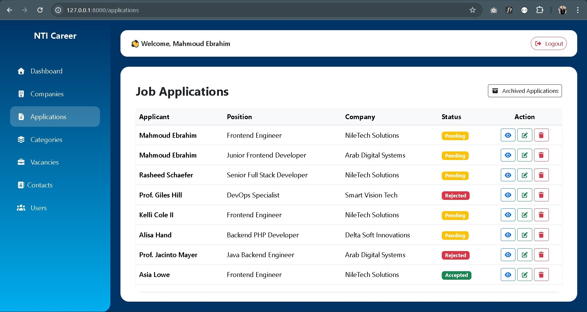

# ForsaHub

**ForsaHub** is a graduation project from **NTI**, a professional job board web application built with **Laravel 12** and **MySQL**. The platform allows users to browse jobs, apply with their CVs, and enables employers to post and manage job listings with strict access control.

---

# Project Showcase (Frontend Screenshots)

<!-- Insert 4 frontend screenshots here -->





---

# Backend Screenshots

<!-- Insert 4 backend screenshots here -->





---

# Features

- Browse jobs easily by category and location.
- Apply to jobs with your CV.
- Full job management system for employers.
- Strict access control and user roles.
- Responsive design with a professional UI.
- Data storage using **MySQL**.

---

# Technologies Used

- **Laravel 12** - Main framework.
- **MySQL** - Database.
- **Bootstrap 5** - Frontend UI framework.
- **Composer & Artisan** - Dependency management and CLI tools.

---

# Installation & Setup

1. Clone the repository:
```bash
git clone https://github.com/username/ForsaHub.git

---

cd ForsaHub

composer install

php artisan key:generate

php artisan migrate

php artisan serve

---

Contributing

This project is open for developers who want to learn or contribute. You can open issues or submit pull requests.

 License

This project is licensed under the MIT License.

---

💻 Backend Development

Backend developed by Mahmoud Ebrahim.

💻 Frontend Development

Frontend developed by Eslam Mohamed.
Frontend developed by Mohamed Elfersisy.
